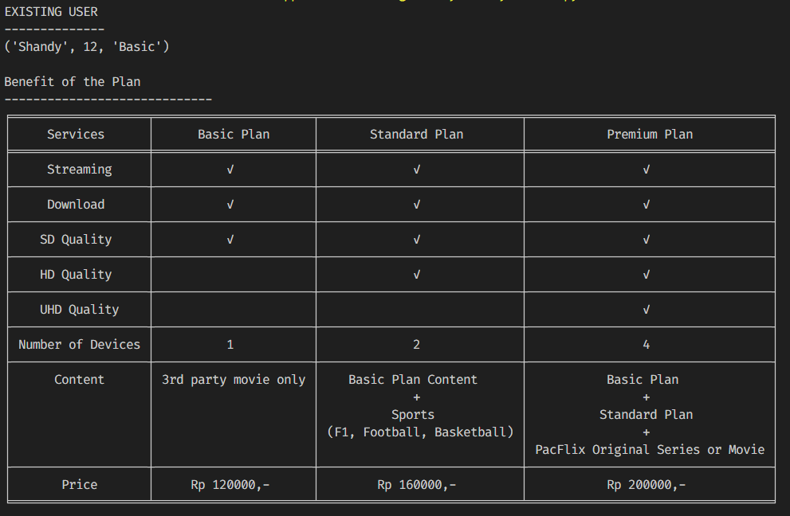

# Video Streaming Service Program

## 1. Case Description

PacFlix is an Video Streaming Service that has three subscription plans:
- **Basic Plan**
- **Standard Plan**
- **Premium Plan**

Each plan has the benefit and price provided in this table: 

| **Basic Plan**       | **Standard Plan**                                       | **Premium Plan**                                               | **Services**   |
|----------------------|---------------------------------------------------------|----------------------------------------------------------------|----------------|
| ✓                    | ✓                                                       | ✓                                                              | can_stream     |
| ✓                    | ✓                                                       | ✓                                                              | can_download   |
| ✓                    | ✓                                                       | ✓                                                              | has_SD         |
|                      | ✓                                                       | ✓                                                              | has_HD         |
|                      |                                                         | ✓                                                              | has_UHD        |
| 1                    | 2                                                       | 4                                                              | num_of_devices |
| 3rd party movie only | Basic Plan Content + Sports  (F1, Football, Basketball) | Basic Plan + Standard Plan +  PacFlix Original Series or Movie | content        |
| Rp 120.000,-         | Rp 160.000,-                                            | Rp 200.000,-                                                   | price          |

## 2. Features Requirement

- Check benefit and price of each plan for new user
- Check current plan and its benefit for existing user
- **User can upgrade plan only**
- Upgrade plan for existing user. **If duration subscribed plan greater than 12 months, existing user can get discount 5%**
- Register data and choose plan for new user. **If new user has an valid referral code, new user can get discount 4%**

## 3. Data

The user data is dictionary type containing:
- Username
- Active/Current plan
- Duration plan
- Referral code

## 4. Test Case

#### 1. Existing User

- Check current plan and its benefit

  -> User **Shandy**
  
  

  

  -> User **Cahya**

  

  

- Upgrade plan

  -> User **Shandy** upgrade from Basic to Standard Plan

  

  -> User **Cahya** upgrade from Standard to Premium Plan

  

#### 2. New User

- Register Data, then check benefit and price of each plan

  

- Choose plan (without and with valid referral code and invalid referral code)

  

  
**Author** Copyright (c) *2024 Muhammad Chavez Assad Patriot*
